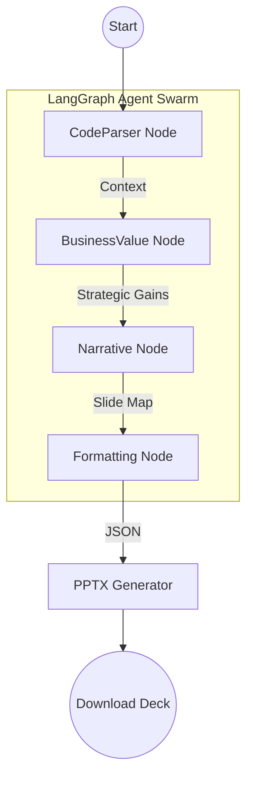

# 🚀 OmniPitchAI
### **Architecture to Executive Narrative. Instantly.**

OmniPitchAI is an elite, autonomous AI pipeline designed to translate raw technical architectures, codebases, and engineering documentation into highly strategic, executive-ready presentation decks. 

Built with a multi-agent **LangGraph** backend and a premium **React** frontend, OmniPitchAI doesn't just summarize—it consults.

---

## ✨ Key Features

- **📂 Zero-Prompt Engine**: Drag and drop a repository ZIP or raw Markdown documentation. No complex prompting required.
- **🧠 Multi-Agent Swarm**: A sophisticated LangGraph pipeline where specialized agents analyze technical complexity, extract ROI/Business Value, and architect a 5-7 slide narrative.
- **🎨 Dynamic Executive Theming**: Native support for premium aesthetics including *Google*, *Apple Monochrome*, *Cyberpunk*, and *Dark Corporate*.
- **📊 Smart Layout Engine**: The system automatically generates horizontal Flowcharts, Key Metric callouts, and strategic bullet points—never just plain text.
- **⚡ Real-time Progression**: Watch the AI agents work in real-time through a live streaming progress tracker with node-by-node updates.
- **👤 Persona-Tailored Strategy**: Tailor the output for specific stakeholders (e.g., CEO, CTO, VC, CFO) to ensure the message resonates with the target audience.
- **🛡️ White-Labeled Output**: Guaranteed professional output with no mentions of "AI" or "OmniPitchAI" in the final deck—it belongs to your organization.

---

## 🛠️ Technical Stack

### **Frontend**
- **Framework**: [React](https://reactjs.org/) + [Vite](https://vitejs.dev/)
- **Language**: [TypeScript](https://www.typescriptlang.org/)
- **Styling**: [Tailwind CSS](https://tailwindcss.com/)
- **Animations**: [Framer Motion](https://www.framer.com/motion/)
- **Icons**: [Lucide React](https://lucide.dev/)

### **Backend**
- **Framework**: [FastAPI](https://fastapi.tiangolo.com/)
- **AI Orchestration**: [LangGraph](https://www.langchain.com/langgraph) & [LangChain](https://www.langchain.com/)
- **Model**: [GPT-4o](https://openai.com/index/gpt-4o-api/) (Structured Outputs)
- **Vector DB**: [Pinecone](https://www.pinecone.io/) (for Enterprise branding guidelines)
- **Generation**: `python-pptx` with custom RGB Theme Mapping & Typography Enforcement

---

## 📐 Architecture Overview

The system operates as a stateful graph:



---

## 🚀 Getting Started

### **Prerequisites**
- Python 3.10+
- Node.js 18+
- OpenAI API Key
- Pinecone API Key

### **1. Backend Setup**
Navigate to the `/backend` directory:
```bash
# Create and activate virtual environment
python -m venv venv
source venv/bin/activate  # Or `venv\Scripts\activate` on Windows

# Install dependencies
pip install -r requirements.txt

# Configure environment
cp .env.example .env
# Edit .env and add your API keys
```

### **2. Frontend Setup**
Navigate to the `/frontend` directory:
```bash
# Install dependencies
npm install

# Run development server
npm run dev
```

---

## 📋 Environment Variables

The backend requires a `.env` file with the following:

```ini
OPENAI_API_KEY=sk-proj-...
PINECONE_API_KEY=pcsk_...
# Optional: DATABASE_URL for user persona persistence
```

---

## 🤝 Contributing

This project is a high-performance demonstration of Agentic Workflows. If you'd like to contribute:
1. Fork the Project
2. Create your Feature Branch (`git checkout -b feature/AmazingFeature`)
3. Commit your Changes (`git commit -m 'Add some AmazingFeature'`)
4. Push to the Branch (`git push origin feature/AmazingFeature`)
5. Open a Pull Request

---

## 📄 License

Distributed under the MIT License. See `LICENSE` for more information.

---

### **Designed by Aisynch Labs**
*Translating raw complexity into strategic clarity.*
